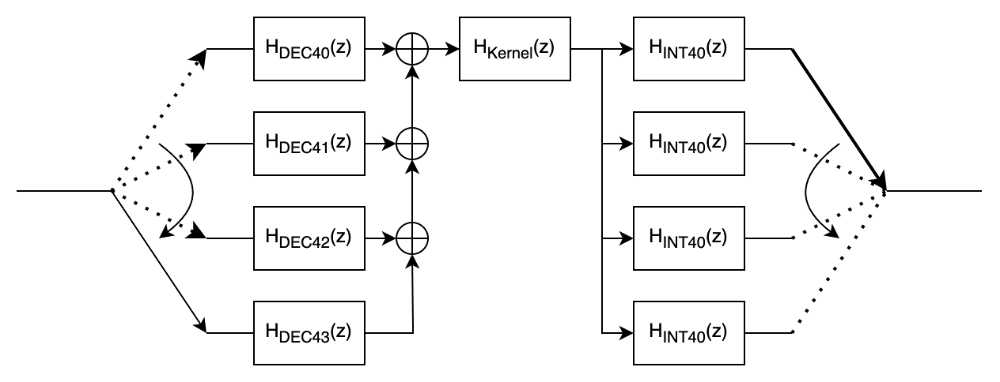

# Multi-rate filters in high-level synthesis (HLS)
This project investigates various implementation strategies for a multi-rate filter within high-level synthesis (HLS).
The aim is to analyse the effects of different optimisation approaches and architectural decisions on the synthesis results, latency and resource utilisation.


## System overview
The filter system consists of a downsampling filter, a kernel filter and an upsampling filter.

## Objective

- Implementation of a multi-rate filter entirely in HLS
- Comparison of different implementation strategies (standard code, optimisation, IP blocks)
- Investigation of the influence of pipelining, loop optimisation and filter partitioning on the synthesis results

## Technical parameters


| Parameter | Value |
|-----|-----------|
| Samplerate | 50 kHz |
| Sampling factor | 4 |
| Filtertype | FIR |
| fpass | 3,1 kHz |
| fstop | 3,35 kHz |
| Target platform | Xilinx Kria KV260 |
| Toolchain | Xilinx Vivado / Vitis 2024.2 |


## 🔬 Implementation Variants

A total of **nine HLS implementations** were developed, differing in structure, optimization level, and IP block usage:

| No. | Category | Description |
|-----|-----------|-------------|
| **1** | Single-Rate | FIR filter in DSP-style implementation (reference) |
| **2** | Single-Rate | FIR filter with HLS-specific optimizations (`#pragma`, static arrays) |
| **3** | Single-Rate | FIR filter using the **Xilinx FIR IP block** |
| **4** | Multirate | Multirate filter in DSP-style implementation (reference) |
| **5** | Multirate | Multirate filter with HLS-specific optimizations (`#pragma`, static arrays) |
| **6** | Multirate | Multirate filter using **Xilinx FIR IP block** |
| **7** | Split-Kernel | Split-kernel design in DSP-style implementation (reference) |
| **8** | Split-Kernel | Split-kernel design with HLS-specific optimizations (`#pragma`, static arrays) |
| **9** | Split-Kernel | Split-kernel design using **Xilinx FIR IP block** |

### Single-Rate FIR-Filter

### Multirate FIR-Filter



### Split-Kernel FIR-Filter


## Implementation

The FIR filter is implemented using the Vitis Unified IDE. Since this is an HLS implementation, the filter is implemented in all its previously described variants as C/C++ code. To do this, the code is divided into several functions. First, an HLS wrapper is used, which is responsible for the interfaces to generate the AXI stream interfaces. This is followed by a function that merges and controls the results of the filters. Finally, the actual filter function that executes the FIR filter follows.


### HLS Wrapper

```
void HLS_FIR(hls::stream<short> &input, hls::stream<short> &output){
  #pragma HLS INTERFACE mode=axis port=input
  #pragma HLS INTERFACE mode=axis port=output
  #pragma HLS INTERFACE mode=ap_ctrl_none port=return
  fir_function(input, output);
}
```
- _hls::stream<short> &input_ specifies that the data is available via the _input_ port as a stream in short format, i.e. only one arrives at a time; the same applies to _output_. The direction of the data flow is only determined with the function.
- Since the wrapper function and thus also the main function are required, the interfaces still need to be defined. To do this, _#pragma HLS INTERFACE mode=axis port=input_ is used, which specifies that the input port should be an AXI stream interface.
- The directive _#pragma HLS INTERFACE mode=ap_ctrl_none port=return_ removes the control ports. These are not necessary, as control is data-driven via the Axi Stream interface.

### Filtercontrol
The filter control is located in the HLS wrapper and is used to control the sequence of events for the multirate and split-kernel variants.


#### Multirate
```
int poly_phase = 0;

switch(poly_phase) {
	case 0:{
			calc_fir_dec_43();
			calc_fir_kernel();
			calc_fir_int_40();
			}; break;
	case 1:{
			calc_fir_dec_40();
			calc_fir_int_41();
			}; break;
	case 2:{
			calc_fir_dec_41();
			calc_fir_int_42();
			}; break;
	case 3:{
			calc_fir_dec_42();
			calc_fir_int_43();
			}; break;
}
```
#### Split-Kernel
```
int poly_phase = 0;

switch(poly_phase) {
	case 0:{
			calc_fir_dec_43();
			calc_fir_kernel_1();
			calc_fir_int_40();
			}; break;
	case 1:{
			calc_fir_dec_40();
			calc_fir_kernel_2();
			calc_fir_int_41();
			}; break;
	case 2:{
			calc_fir_dec_41();
			calc_fir_kernel_3();
			calc_fir_int_42();
			}; break;
	case 3:{
			calc_fir_dec_42();
			calc_fir_kernel_4();
			calc_fir_int_43();
			}; break;
}
```
### Filterfunction

#### DSP code of the FIR filter function

```
short FIR_filter(short FIR_delays[], const short FIR_coe[], short int N_delays, short x_n, int shift){
	short i, y;
	int FIR_accu32=0;

// delays BACKWARDS, coefficients in FORWARD direction
	FIR_delays[N_delays-1] = x_n;	// read input sample from ADC 
// accumulate in 32 bit variable
	FIR_accu32	= 0;				// clear accu
	for(i=0; i < N_delays; i++)		// FIR filter routine
		FIR_accu32 += FIR_delays[N_delays-1-i] * FIR_coe[i];
	
// loop to shift the delays
	for(i=1; i < N_delays; i++)				
		FIR_delays[i-1] = FIR_delays[i];

// shift back by 15 bit to obtain short int 16 bit output 
	y = (short) (FIR_accu32 >>shift);
	return y;
}

```

#### HLS code of the FIR filter function

```
typedef ap_fixed<16,1> fir_data; //defining a fixed-point data type

fir_data FIR_filter(fir_data FIR_delays[], const fir_data FIR_coe[], short int N_delays, fir_data x_n){
	fir_data y;
	ap_fixed<32,2>  FIR_accu32=0;

  // delays BACKWARDS, coefficients in FORWARD direction
	FIR_delays[N_delays-1] = x_n;	// read input sample from ADC

  // accumulate in 32 bit variable
	FIR_accu32	= 0;				// clear accu
	for(int i=0; i < N_delays; i++)		// FIR filter routine
		FIR_accu32 += FIR_delays[N_delays-1-i] * FIR_coe[i];
	
// loop to shift the delays
	for(int i=1; i < N_delays; i++)				
		FIR_delays[i-1] = FIR_delays[i];
 
	y = (fir_data) FIR_accu32;
	return y;
}

```


#### HLS code with FIR filter IP core

```
void
```


## Results

| variant  |  latency [ns] | FF  |  LUT |  BRAM |  DSP |
|---|---|---|---|---|---|
|  1 | 7940  |  167 | 134  | 2  | 1  |
|  2 |   |   |   |   |   |
|  3 |   |   |   |   |   |
|  4 |   |   |   |   |   |
|  5 |   |   |   |   |   |
|  6 |   |   |   |   |   |
|  7 |   |   |   |   |   |
|  8 |   |   |   |   |   |
|  9 |   |   |   |   |   |
