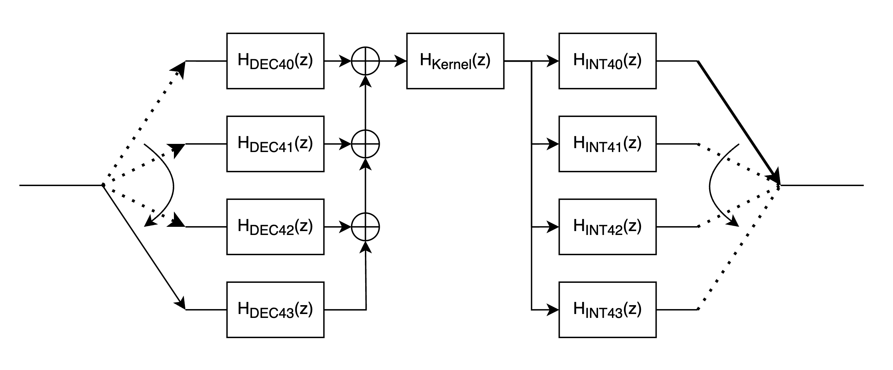

# Multi-rate filters in high-level synthesis (HLS)
This project investigates various implementation strategies for a multi-rate filter within high-level synthesis (HLS).
The aim is to analyse the effects of different optimisation approaches and architectural decisions on the synthesis results, latency and resource utilisation.




## Objective

- Implementation of a multi-rate filter entirely in HLS
- Comparison of different implementation strategies (standard code, optimisation, IP blocks)
- Investigation of the influence of pipelining, loop optimisation and filter partitioning on the synthesis results

## Technical parameters


| Parameter | Value |
|-----|-----------|
| Samplerate | 50 kHz |
| Sampling factor | 4 |
| Filtertype | FIR |
| fpass | 3,1 kHz |
| fstop | 3,35 kHz |
| Target platform | Xilinx Kria KV260 |
| Toolchain | Xilinx Vivado / Vitis 2024.2 |


## 🔬 Implementation Variants

A total of **nine HLS implementations** were developed, differing in structure, optimization level, and IP block usage:

| No. | Category | Description |
|-----|-----------|-------------|
| **1** | Single-Rate | FIR filter in DSP-style implementation (reference) |
| **2** | Single-Rate | FIR filter with HLS-specific optimizations (`#pragma`, static arrays) |
| **3** | Single-Rate | FIR filter using the **Xilinx FIR IP block** |
| **4** | Multirate | Multirate filter in DSP-style implementation (reference) |
| **5** | Multirate | Multirate filter with HLS-specific optimizations (`#pragma`, static arrays) |
| **6** | Multirate | Multirate filter using **Xilinx FIR IP block** |


## Implementation

The FIR filter is implemented using the Vitis Unified IDE. Since this is an HLS implementation, the filter is implemented in all its previously described variants as C/C++ code. To do this, the code is divided into two functions. First, an HLS wrapper is used, which is responsible for the interfaces to generate the AXI stream interfaces. This is followed by the actual filter function that executes the FIR filter follows.

### HLS Wrapper

```
void HLS_FIR(hls::stream<short> &input, hls::stream<short> &output){
  #pragma HLS INTERFACE mode=axis port=input
  #pragma HLS INTERFACE mode=axis port=output
  #pragma HLS INTERFACE mode=ap_ctrl_none port=return
  fir_function(input, output);
}
```
- _hls::stream<short> &input_ specifies that the data is available via the _input_ port as a stream in short format, i.e. only one arrives at a time; the same applies to _output_. The direction of the data flow is only determined with the function.
- Since the wrapper function and thus also the main function are required, the interfaces still need to be defined. To do this, _#pragma HLS INTERFACE mode=axis port=input_ is used, which specifies that the input port should be an AXI stream interface.
- The directive _#pragma HLS INTERFACE mode=ap_ctrl_none port=return_ removes the control ports. These are not necessary, as control is data-driven via the Axi Stream interface.


### Filterfunction

#### DSP code of the FIR filter function

```
short FIR_filter(short FIR_delays[], const short FIR_coe[], short int N_delays, short x_n, int shift){
	short i, y;
	int FIR_accu32=0;

	FIR_delays[N_delays-1] = x_n;

	FIR_accu32	= 0;		
	for(i=0; i < N_delays; i++)	
		FIR_accu32 += FIR_delays[N_delays-1-i] * FIR_coe[i];
	
	for(i=1; i < N_delays; i++)				
		FIR_delays[i-1] = FIR_delays[i];

	y = (short) (FIR_accu32 >>shift);
	return y;
}

```

#### HLS code of the FIR filter function

```
typedef ap_fixed<16,1> fir_data_t; //defining a fixed-point data type

fir_data_t FIR_filter(delay_data_t FIR_delays[], const coef_data_t FIR_coe[], int N_delays, fir_data_t x_n){
    #pragma HLS PIPELINE
	fir_data_t y;
	ap_fixed<32,2> FIR_accu32=0;

	FIR_delays[N_delays-1] = x_n;	// read input sample from ADC 
	FIR_accu32	= 0;				// clear accu
	for(int i=0; i < N_delays; i++)		// FIR filter routine
		FIR_accu32 += FIR_delays[N_delays-1-i] * FIR_coe[i];

	for(int i=1; i < N_delays; i++)				
		FIR_delays[i-1] = FIR_delays[i];
 
	y = (fir_data_t) (FIR_accu32);
	return y;
}

```


#### HLS code with FIR filter IP core

```
void
```


## Testbench
Each HLS variant includes a dedicated **C++ testbench** that verifies the functional correctness of the filter design against MATLAB-generated reference data.

### Test Flow

1. **Input Signal Loading:**
The testbench reads a precomputed test signal from a `.dat` file located in the `Matlab/` directory.  
   Each line of the file represents one sample of the input signal (typically a short or floating-point value).
2. **Filter Execution:**
The main HLS function (e.g., HLS_FIR() ) is called with the loaded samples as input.
The testbench processes all samples sequentially and stores the output in a results buffer.
3. **Reference Comparison:**
After processing, the testbench loads the expected output values from a `.res` file located in the `Matlab/` directory and compares them with the HLS results.
The comparison can be based on absolute error, mean squared error (MSE), or a tolerance threshold.
4. **Result Reporting:**
The testbench prints a concise summary to the console, including the number of mismatches and the overall pass/fail status:
```
---------------------------------------
Testbench Results
Samples processed: 1024
Mismatches: 0
Status: PASS ✅
---------------------------------------
```

### Integration with HLS
During synthesis, this testbench is used for both C-simulation and C/RTL co-simulation in Vivado or Vitis HLS.
It allows functional validation before synthesis and direct comparison between the C++ model and the generated HDL implementation.


## Results

| variant  |  latency [ns] | FF  |  LUT |  BRAM |  DSP |
|---|---|---|---|---|---|
|  1 | 7940  |  167 | 134  | 2  | 1  |
|  2 |  80 |  9259 |  4937 | 0  |  81 |
|  3 |   |   |   |   |   |
|  4 |  2680 | 698  | 937  | 0  | 3  |
|  5 |  990 | 2630  |  2552 | 1  |  81 |
|  6 |   |   |   |   |   |


## 🧩 Open Points and Known Issues

### ✅ To-Do
**Integration of the Xilinx FIR IP Core:**
- The current implementation uses the function stubs and coefficient setup, but the actual instantiation of the `hls::FIR object` and correct parameterization (`hls::ip_fir::params_t`) are still pending.


### ⚠️ Known Issues
**DSP Testbench Overflow:**
- The testbench for the DSP baseline version (non-multirate) occasionally triggers a buffer overflow during simulation.

**Multirate Testbench Mismatch (Samples 280–300):**
- Both multirate versions (DSP and HLS) show output mismatches between sample index 280 and 300. The issue appears consistently.


